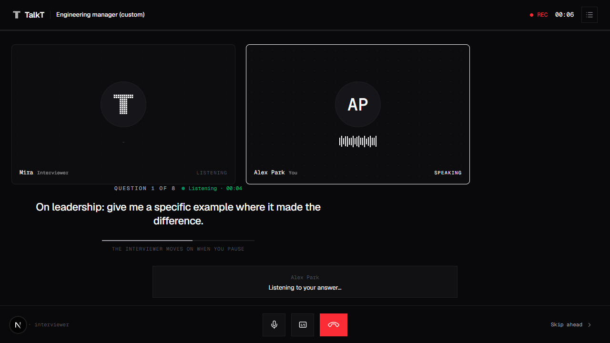
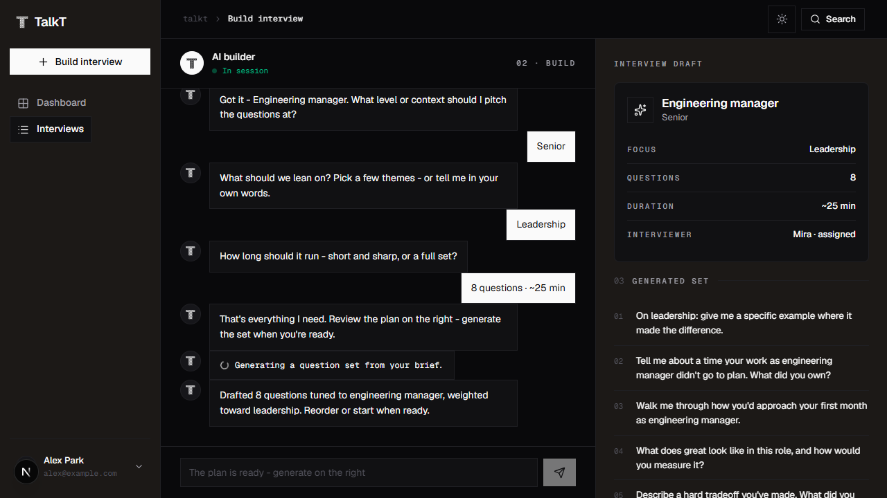
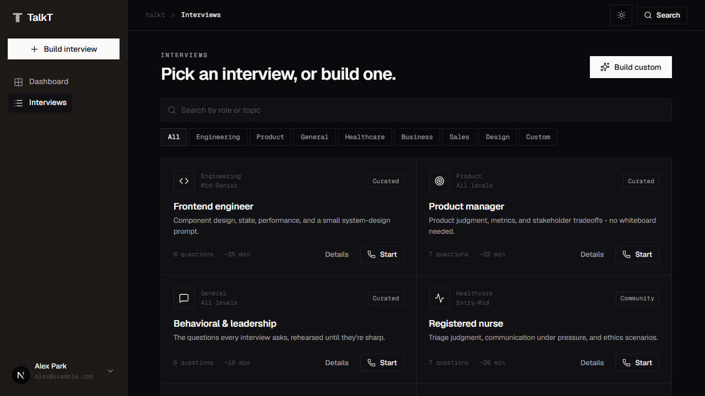
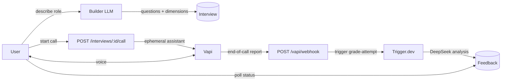

<div align="center">

<picture>
  <source media="(prefers-color-scheme: dark)" srcset="docs/assets/logo-dark.svg">
  <source media="(prefers-color-scheme: light)" srcset="docs/assets/logo.svg">
  
</picture>

### AI voice interviews — design one, talk it through, get scored.

Practice interviews **out loud** with a real-time AI interviewer, then get a structured, evidence-backed report seconds after you hang up.

[](https://nextjs.org)
[](https://react.dev)
[](https://www.typescriptlang.org)
[](https://www.prisma.io)
[](https://www.postgresql.org)
[](LICENSE)

</div>

---

## What is talkt?

**talkt** is a full-stack web app for spoken interview practice. You describe the
interview you want in a short chat, an AI builder turns that into a structured
interview (questions + the dimensions it should be scored on), and then you
**actually talk to an AI interviewer** over your microphone. When the call ends,
the transcript is graded asynchronously and you get a report: an overall score,
per-dimension scores with notes, per-question critique with model answers, and
concrete strengths and improvements — all backed by quotes from what you said.

Good interviews don't have to stay private. Publish a custom interview to the
public **directory**, where a Reddit-style vote + Wilson-ranking system surfaces
the best ones, and a per-user content-based recommender re-orders the catalog
around what each person has been practicing.

<div align="center">
  
  
  <br/>
  
  
</div>

## Features

- 🎙️ **Real-time voice interview** — talk to an AI interviewer with natural
  turn-taking, patience for "thinking out loud", and persona voices (per language).
- 💬 **Conversational builder** — describe a role; an LLM proposes the questions
  and the 4 scoring dimensions, with live suggestions and a running summary.
- 📊 **Automated, evidence-backed grading** — overall + per-dimension scores,
  per-question critique and model answers, strengths/improvements with quotes.
- 🌍 **Multi-language** — question generation, the interviewer's voice, and the
  written report all follow the interview's language.
- 🏆 **Public template directory** — publish custom interviews, vote them up/down;
  a Wilson lower-bound rank surfaces quality over raw count, with auto-takedown of
  heavily-downvoted templates.
- 🎯 **Personalized recommendations** — a recency-decayed, content-based profile
  re-orders the directory per user with no cross-account data and no cold-start cliff.
- 🔒 **Secure by default** — auth on every route (protected-first middleware),
  rate-limited cost-bearing endpoints, fail-closed webhook verification, and a
  server-only privacy seam so prompts and questions never reach the browser.

## Tech stack

| Layer | Choice |
|---|---|
| Framework | **Next.js 16** (App Router) + **React 19** + **TypeScript** |
| Styling | **Tailwind CSS v4**, **shadcn/ui** + **Radix UI**, Geist font |
| Auth | **Clerk** |
| Database | **PostgreSQL** via **Prisma 7** (`@prisma/adapter-pg`) |
| Voice | **Vapi** (`@vapi-ai/web` client, `@vapi-ai/server-sdk`) |
| LLM | **DeepSeek** (OpenAI-compatible) for builder + grading |
| Background jobs | **Trigger.dev** (durable, idempotent grading task) |
| Object storage | **Vercel Blob** (transcripts, raw analysis) |
| Hosting | **Vercel** |

## How it works



1. **Build** — the builder endpoint runs one LLM turn at a time, returning a
   strict-shaped interview (questions + scoring dimensions). Saved as a *private*
   custom interview.
2. **Call** — the server provisions an **ephemeral** Vapi assistant (system prompt
   and questions stay server-side), opens an `Attempt`, and hands the browser only
   the assistant id + public key. The browser runs the call with `@vapi-ai/web`.
3. **Grade** — when the call ends, Vapi posts an end-of-call report to the
   (secret-verified) webhook, which fires the idempotent `grade-attempt`
   Trigger.dev task. DeepSeek scores the transcript; structured `Feedback` is
   stored and the raw analysis goes to Blob. The results screen polls until ready.
4. **Share** — publish a custom interview to the public directory; votes re-rank it
   (Wilson lower bound) and the recommender personalizes each viewer's order.

See [`docs/architecture.md`](docs/architecture.md) for the full picture.

## Quick start

> **Prerequisites:** Node.js 20+, a PostgreSQL database, and accounts/keys for
> Clerk, Vapi, DeepSeek, Trigger.dev, and Vercel Blob. See
> [`docs/configuration.md`](docs/configuration.md) for every variable.

```bash
# 1. Install
npm install

# 2. Configure — copy the template and fill in real values
cp .env.example .env.local

# 3. Set up the database
npm run db:migrate      # apply migrations
npm run db:seed         # seed starter templates + voice personas

# 4. Run
npm run dev             # http://localhost:3000
```

> **Local voice note:** Vapi cannot reach `localhost`, so end-of-call webhooks are
> repaired by server-side call reconciliation. For real webhooks locally, set
> `VAPI_WEBHOOK_URL` to a public tunnel (ngrok / Vapi CLI). Details in
> [`docs/voice-interview.md`](docs/voice-interview.md).

## Scripts

| Command | What it does |
|---|---|
| `npm run dev` | Start the dev server |
| `npm run build` | Production build |
| `npm run start` | Serve the production build |
| `npm run lint` | ESLint |
| `npm test` | Unit tests (`tests/unit/*.test.ts`, Node test runner) |
| `npm run db:migrate` | Apply Prisma migrations (dev) |
| `npm run db:generate` | Generate the Prisma client |
| `npm run db:seed` | Seed templates + voice personas |
| `npm run db:studio` | Open Prisma Studio |
| `npm run db:check` | Sanity-check the DB connection/schema |

## Documentation

| Doc | Contents |
|---|---|
| [Architecture](docs/architecture.md) | System overview, request flows, module map |
| [Data model](docs/data-model.md) | Prisma schema, relations, indexes |
| [Voice interview](docs/voice-interview.md) | Vapi call lifecycle, webhook, reconciliation |
| [Grading](docs/grading.md) | Transcript analysis + durable grading task |
| [Directory & ranking](docs/directory-ranking.md) | Voting, Wilson rank, auto-flag, recommender |
| [API reference](docs/api-reference.md) | Every route handler: method, auth, body, response |
| [Caching](docs/caching-strategy.md) | Cache keys, TTLs, invalidation, ownership boundaries |
| [Configuration](docs/configuration.md) | Every environment variable |
| [Development](docs/development.md) | Local setup, testing, conventions |
| [Deployment](docs/deployment.md) | Vercel + production go-live checklist |
| [Security](docs/security.md) | Auth, secrets, rate limits, data handling |

## Project layout

```
app/            Next.js App Router — pages + /api route handlers
components/     UI — talkt/ (feature screens) + ui/ (shadcn primitives)
lib/            Server logic — db/, vapi/, llm, analysis, ranking, recommend, …
prisma/         Schema, migrations, seed
trigger/        Trigger.dev tasks (grade-attempt)
tests/unit/     Unit tests (pure logic)
docs/           This documentation
proxy.ts        Clerk auth middleware (protected-first)
```

## Contributing

Contributions are welcome — see [`CONTRIBUTING.md`](CONTRIBUTING.md). Found a
security issue? Please follow [`SECURITY.md`](SECURITY.md) rather than opening a
public issue.

## License

[MIT](LICENSE) © 2026 yeabwang
