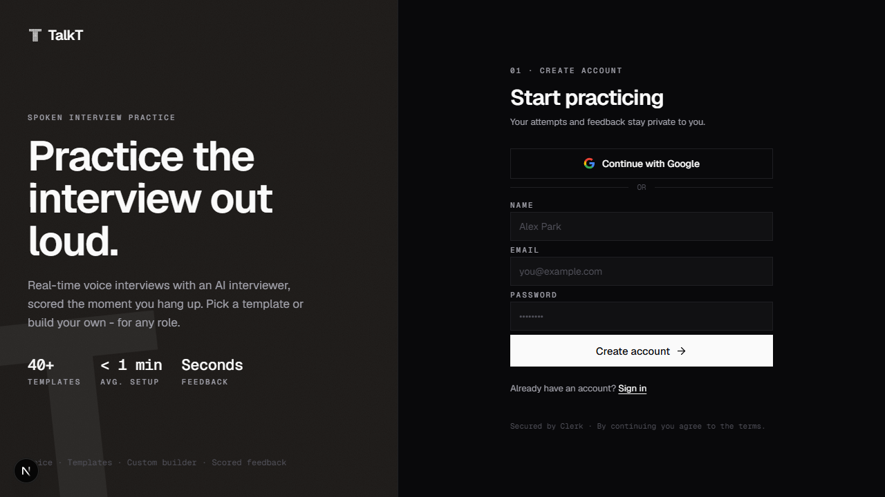
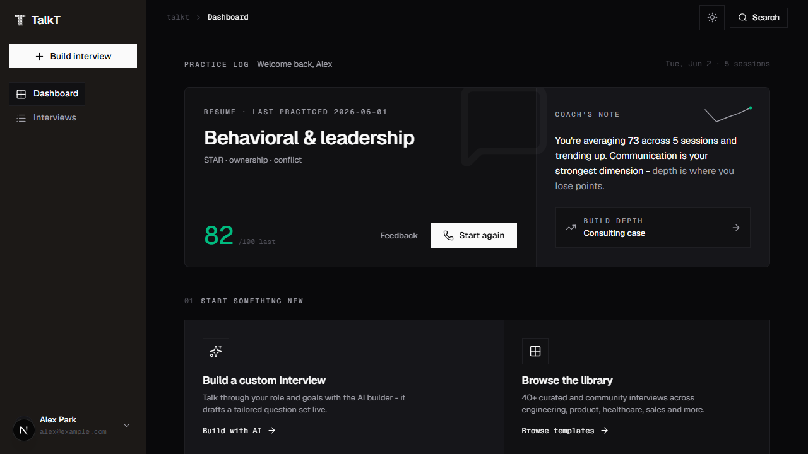
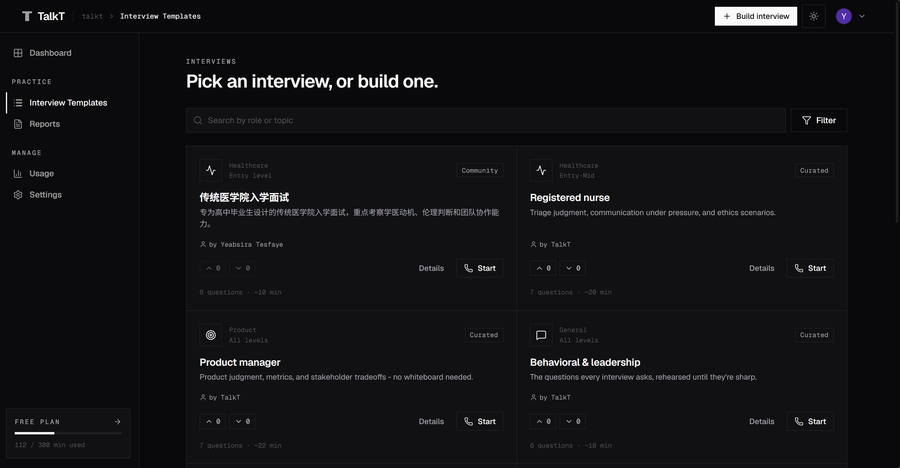
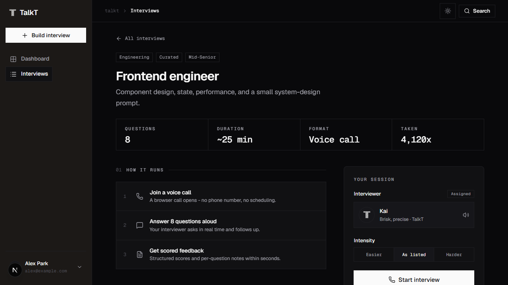
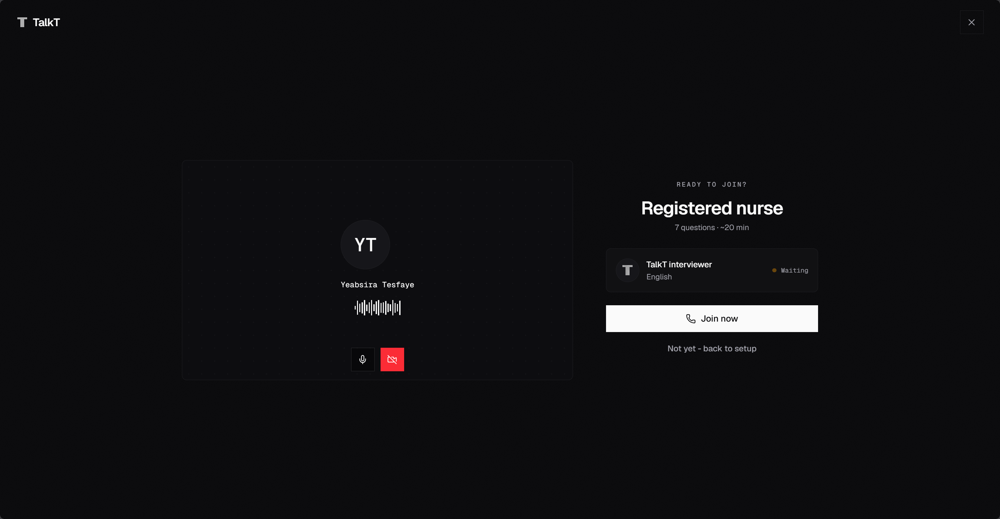
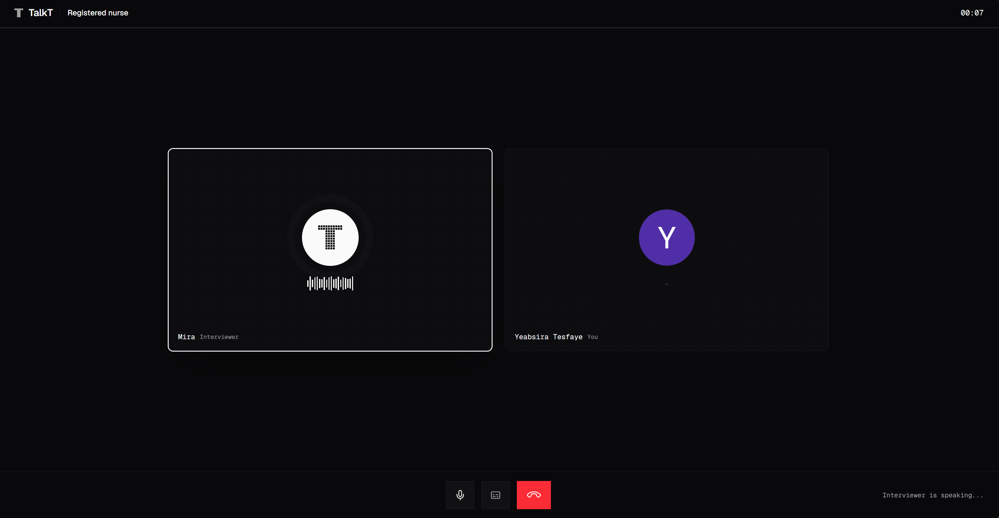
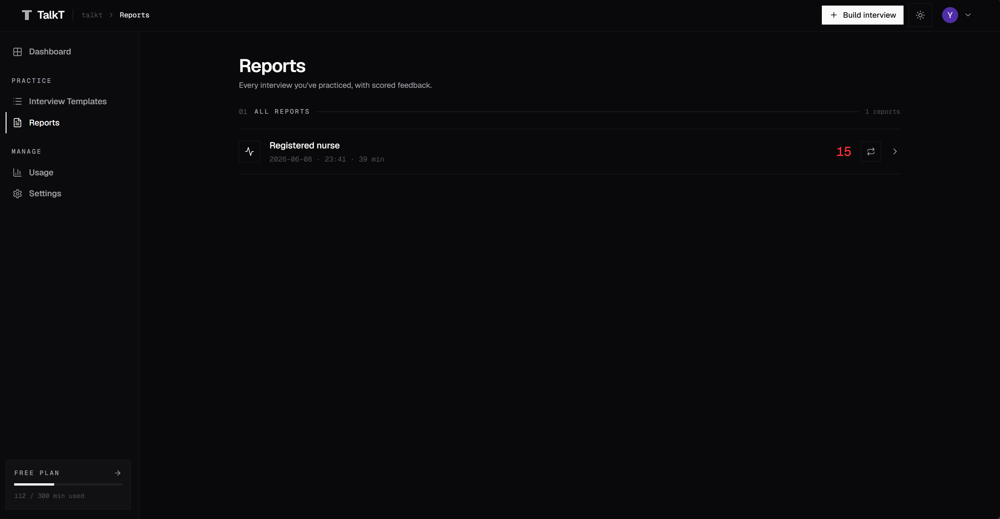
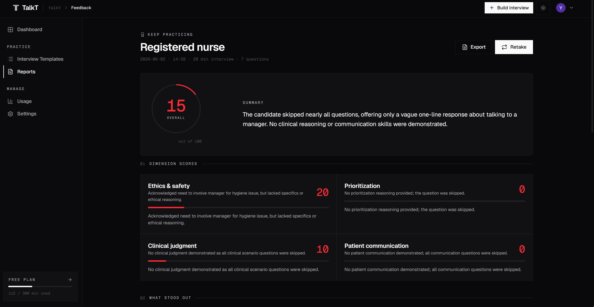
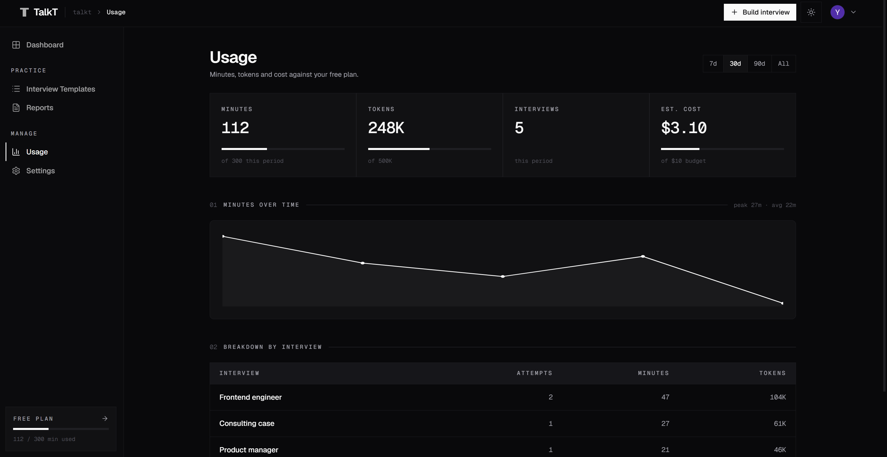

<p align="center">
  <picture>
    <source media="(prefers-color-scheme: dark)" srcset="doc/assets/logo-dark.svg">
    <source media="(prefers-color-scheme: light)" srcset="doc/assets/logo.svg">
    
  </picture>
</p>

TalkT is a place for spoken interview practice. Users create or select an interview, take it through a Vapi browser voice call, then get a structured score report from DeepSeek grading. Practice is most useful when it feels close to the real thing. TalkT lets users rehearse out loud, get interrupted, think on their feet, and see exactly where their answers were strong or thin before the actual interview.

## Screenshots

<table>
  <tr>
    <td></td>
    <td></td>
  </tr>
  <tr>
    <td></td>
    <td></td>
  </tr>
  <tr>
    <td></td>
    <td></td>
  </tr>
  <tr>
    <td></td>
    <td></td>
  </tr>
  <tr>
    <td></td>
    <td></td>
  </tr>
</table>

### Core Features

| Feature                      |                                                                                                                            |
| :--------------------------- | -------------------------------------------------------------------------------------------------------------------------- |
| Custom interview builder     | Turn a target role, topic, language, and difficulty into a focused interview without writing prompts by hand.              |
| Template library             | Start fast from curated and community interviews when users do not want to build from scratch.                             |
| Real-time voice interview    | Practice speaking under realistic pressure in the browser, with an interviewer that asks the stored question set out loud. |
| Multi-language flow          | Builder output, interviewer voice, and report prose follow the selected interview language.                                |
| Interviewer personas         | Choose a voice and tone that fit the session, from calmer coaching to sharper interview pressure.                          |
| Structured grading           | Get an overall score, dimension scores, strengths, improvements, and per-question critique after the call.                 |
| Suggested answers            | See what a stronger answer could have sounded like, question by question.                                                  |
| Progress history             | Keep every scored attempt so users can compare sessions and track improvement over time.                                   |
| Public directory ranking     | Voting and Wilson ranking surface useful interviews without relying only on raw popularity.                                |
| Personalized recommendations | Recent practice history shapes the template order while cold-start users still see ranked templates.                       |

## Stack

| Area      | Tooling                                           |
| --------- | ------------------------------------------------- |
| App       | Next.js 16, React 19, TypeScript                  |
| UI        | Tailwind CSS 4, shadcn/ui, Radix UI, Geist        |
| Auth      | Clerk                                             |
| Data      | Prisma 7, PostgreSQL                              |
| Voice     | Vapi Web SDK and server SDK                       |
| LLM       | DeepSeek through an OpenAI-compatible JSON client |
| Jobs      | Trigger.dev                                       |
| Artifacts | Vercel Blob                                       |

## Local Setup

Prerequisites:

- Node.js 20+
- PostgreSQL
- Clerk, Vapi, DeepSeek, Trigger.dev, and Vercel Blob credentials

```bash
npm install
cp .env.example .env.local
npm run db:migrate
npm run db:seed
npm run dev
```

Run the Trigger.dev worker in a second terminal when testing grading:

```bash
npx trigger.dev dev
```

Local Vapi webhooks need a public tunnel. Without one, status polling can repair
missed callbacks through Vapi call reconciliation.

## Commands

| Command           | Purpose                    |
| ----------------- | -------------------------- |
| `npm run dev`   | Start the dev server       |
| `npm run build` | Build for production       |
| `npm run start` | Serve the production build |
| `npm run lint`  | Run ESLint                 |

## Runtime Flow

1. `POST /api/builder` runs one builder LLM turn.
2. `POST /api/interviews` stores a generated private interview.
3. `POST /api/interviews/:id/call` creates an attempt and a Vapi ephemeral assistant.
4. The browser starts Vapi with the returned `assistantId` and public key.
5. `POST /api/attempts/:id/grade` sends the captured transcript and triggers `grade-attempt`.
6. Trigger.dev runs DeepSeek grading, stores `Feedback`, and streams progress to the results screen.
7. `POST /api/vapi/webhook` and Vapi reconciliation are server-side fallbacks.

## Documentation

| Doc                                        | Use it for                         |
| ------------------------------------------ | ---------------------------------- |
| [Architecture](doc/architecture.md)           | System boundaries and request flow |
| [API reference](doc/api-reference.md)         | Route handlers, auth, payloads     |
| [Data model](doc/data-model.md)               | Prisma models and indexes          |
| [Voice interview](doc/voice-interview.md)     | Vapi assistant and call lifecycle  |
| [Grading](doc/grading.md)                     | Trigger task and DeepSeek analysis |
| [Directory ranking](doc/directory-ranking.md) | Publishing, votes, recommendations |
| [Caching](doc/caching-strategy.md)            | Directory cache and invalidation   |
| [Configuration](doc/configuration.md)         | Environment variables              |
| [Development](doc/development.md)             | Local workflow and conventions     |
| [Deployment](doc/deployment.md)               | Production checklist               |
| [Security](doc/security.md)                   | Auth, secrets, data handling       |

## Project Layout

```text
app/            Next.js pages and API route handlers
components/     TalkT feature screens and shadcn primitives
lib/            Server logic, repositories, integrations, pure helpers
prisma/         Schema, migrations, seed data
trigger/        Trigger.dev tasks
tests/unit/     Node test runner suites
doc/            Developer documentation
proxy.ts        Clerk middleware
```

## License

[MIT](LICENSE)
