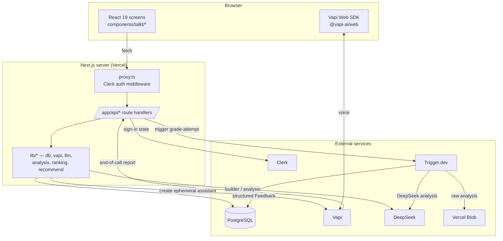

# Architecture

talkt is a single Next.js 16 application. The browser renders feature screens and
talks to its own `/api` route handlers; the server owns all business logic, the
database, and every third-party integration. Voice runs through Vapi; grading runs
out-of-band on Trigger.dev.

## High-level diagram

## Layers

### Routing & pages (`app/`)
The App Router serves pages (`app/<route>/page.tsx`) and JSON route handlers
(`app/api/<route>/route.ts`). Auth pages live under the `(auth)` route group;
everything else is protected by the middleware. `app/page.tsx` redirects to
`/dashboard`.

### Auth middleware (`proxy.ts`)
Clerk's `clerkMiddleware` runs **protected-first**: every route requires a session
*except* the sign-in / sign-up routes (derived from the Clerk env vars). There is
no "list of protected routes" to keep in sync — you opt routes *out*, not in.

### UI (`components/`)
- `components/talkt/*` — the feature screens (dashboard, builder, library, lobby,
  live call, results, reports, usage, settings) plus the client API wrapper
  (`api.ts`), the Vapi call hook (`use-vapi-call.ts`), and shared primitives.
- `components/ui/*` — shadcn/Radix primitives (button, card, dialog, …).

Client data loading is tracked with `Loadable<T>` (`lib/loadable.ts`) so screens
show skeletons instead of empty-state flashes, and the resolved user is cached in
`sessionStorage`. See [Caching](caching-strategy.md#client-caching).

### Server logic (`lib/`)
| Area | Modules |
|---|---|
| Database (repository layer) | `lib/db/*` — `interviews`, `attempts`, `users`, `votes`, `voice-agents`, `directory-cache` |
| Privacy seam | `lib/dto.ts` — maps DB rows to client-safe shapes |
| Voice | `lib/vapi/*` — `assistant` (payload builder), `job`, `prompt`, `voices`, `server` (SDK), `webhook` (pure parse/verify), `reconcile` |
| LLM | `lib/llm.ts` (DeepSeek client), `lib/analysis.ts` (grading), builder prompt in the route |
| Ranking & recs | `lib/ranking.ts` (Wilson + auto-flag), `lib/recommend.ts` (content-based profile) |
| Cross-cutting | `lib/api.ts` (HTTP helpers), `lib/rate-limit.ts`, `lib/pagination.ts`, `lib/validate.ts`, `lib/blob.ts`, `lib/language.ts`, `lib/transcript.ts`, `lib/session-ended.ts` |

The `lib/*` modules that hold pure logic (`ranking`, `recommend`, `pagination`,
`validate`, `transcript`, `session-ended`, `vapi/webhook`, `vapi/assistant`,
`vapi/prompt`, `dto`, `loadable`) are deliberately free of Prisma / SDK / network
imports so they can be unit-tested with literals — see `tests/unit/`.

### Background jobs (`trigger/`)
`trigger/grade-attempt.ts` is a durable, idempotent Trigger.dev task. Grading runs
here, not inline in a request, so the call-ending path returns immediately. See
[Grading](grading.md).

## Core request flows

### Build an interview
`Builder screen → POST /api/builder` runs one LLM turn (history in, strict
`BuilderTurn` out: response, suggestions, running summary, and eventually the final
question + dimension set). `POST /api/interviews` persists the result as the
caller's **private** custom interview.

### Run a voice interview
`POST /api/interviews/:id/call` resolves an interviewer persona/voice, opens an
`Attempt`, and creates an **ephemeral** Vapi assistant server-side (the system
prompt and questions never leave the server). The browser receives only the
assistant id + public key and runs the call with the Vapi Web SDK. Full detail in
[Voice interview](voice-interview.md).

### Grade & report
When the call ends, Vapi POSTs an end-of-call report to `POST /api/vapi/webhook`
(shared-secret verified, fail-closed in production). The webhook classifies the
outcome and, for a completed interview, triggers `grade-attempt` with idempotency
key `grade-{attemptId}`. The results screen polls `GET /api/attempts/:id` until the
status flips to `ready`. See [Grading](grading.md).

### Publish & discover
`POST /api/interviews/:id/publish` makes a custom interview public.
`POST /api/interviews/:id/vote` casts/clears a vote, recomputes the rank in one
transaction, and may auto-flag the template. The directory is read via
`GET /api/templates/recommended` (per-user order) with `GET /api/templates` as the
fallback. See [Directory & ranking](directory-ranking.md).

## Data & artifacts
Relational metadata and structured feedback live in PostgreSQL (Prisma). Bulky
artifacts — the raw DeepSeek analysis — go to Vercel Blob; only the blob URL is
stored in the row. Raw transcripts are *not* persisted to our storage: they live in
the Trigger run payload (replayed on retry) and are discarded after grading. See
[Data model](data-model.md) and [Security](security.md#data-handling).
