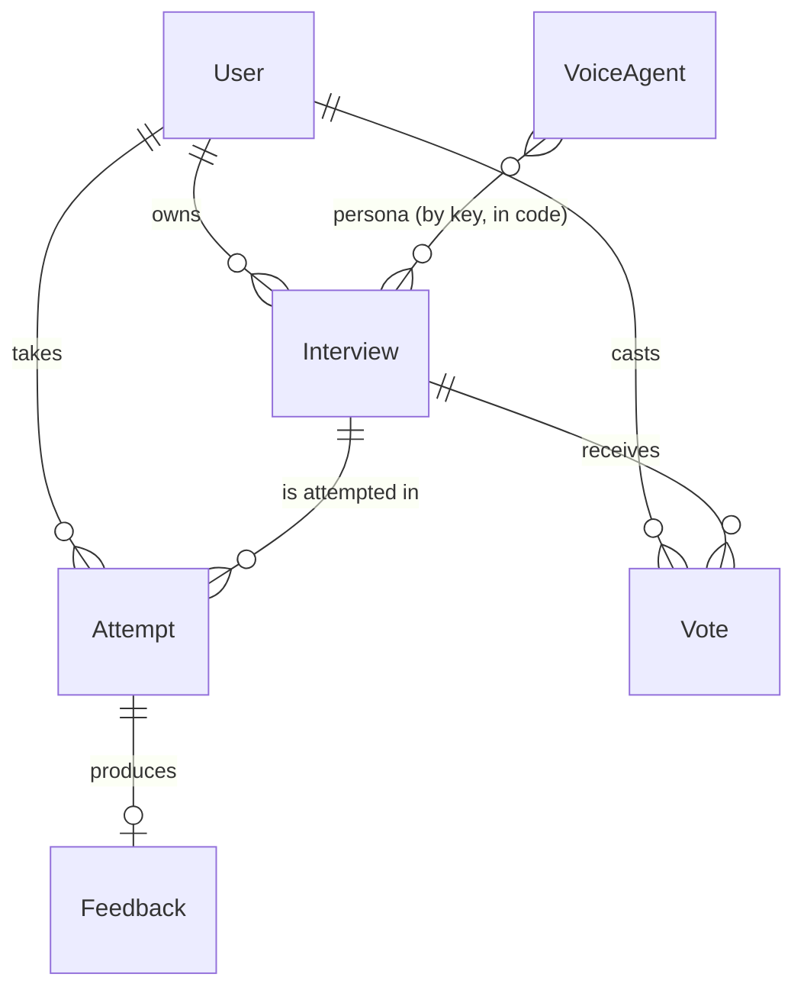

# Data model

PostgreSQL via Prisma 7 (`@prisma/adapter-pg`). The schema holds relational
metadata and structured feedback; bulky artifacts (raw analysis) live in Vercel
Blob and are referenced by URL. Source of truth: [`prisma/schema.prisma`](../prisma/schema.prisma).

## Models

### User
A thin profile row keyed by the **Clerk user id** (no password/credentials stored
here — Clerk owns auth). Cascade-deletes the user's interviews, attempts, and votes.

| Field | Notes |
|---|---|
| `id` | Clerk user id (primary key) |
| `email` | optional, unique |
| `name` | optional |

### Interview
A reusable interview definition. `type` is `template` (system-seeded) or `custom`
(user-built); `visibility` is `private` or `public`. `ownerId` is `null` for system
templates.

Key fields:
- `questions` (`Json`) — ordered `Question[]`.
- `dimensions` (`Json`) — the 4 scoring dimensions the builder chose for the role:
  `[{ key, label, weight? }]`. Grading scores exactly these.
- `language` — ISO 639-1; drives question generation, interviewer voice, and the report.
- `voiceConfig` (`Json?`) — `{ voiceId }`.
- **Publishing/attribution:** `publishedAt`, `authorName`, `anonymous`.
- **Voting (denormalized):** `upvotes`, `downvotes`, `rankScore` (Wilson lower bound
  with the anonymity down-weight baked in).
- **Auto-takedown:** `flagged`, `flaggedAt`.

Indexes: `[ownerId]`, `[type, visibility]`, and the directory read index
`[flagged, visibility, type, rankScore]` (filter out flagged/private, order by rank).

### Vote
One up/down vote per user per interview, toggleable/clearable. `value` is `1`
(up) or `-1` (down). The `@@unique([userId, interviewId])` constraint enforces one
vote per user per interview at the database level.

### Attempt
One run of an interview by a user.

| Field | Notes |
|---|---|
| `status` | `in_progress` → `analyzing` → `ready`, or `failed` / `abandoned` |
| `vapiCallId` | Vapi call id (unique; correlation / defensive join key) |
| `vapiAssistantId` | ephemeral assistant id (deleted by the end-of-call webhook) |
| `transcriptBlobUrl` | optional; transcripts are normally *not* persisted (see below) |

`abandoned` = the candidate ended the call before a real interview happened; never
graded, hidden from history. Indexes back the history list (`[userId, status,
startedAt]`) and the recommender facet read (`[userId, startedAt]`).

### Feedback
The structured grade for an attempt (1:1). `overallScore`, `summary`,
`dimensionScores` (`Json`, keyed to the interview's `dimensions`), `strengths`,
`improvements`, `perQuestion` (`Json`: `[{ questionId, ratingScore, modelAnswer,
critique }]`), and `rawBlobUrl` (the raw DeepSeek output in Blob).

### VoiceAgent
The pool of interviewer personas surfaced in the UI (`adi` / `ren` / `kai` /
`mira`). A **pure persona record** — `key`, `name`, `tone`, `language`. The actual
spoken Vapi TTS voice is resolved in code from a per-language catalog
(`lib/vapi/voices.ts`), so there is no provider or voice id to swap here.

## Enums
- `InterviewType` — `template`, `custom`
- `Visibility` — `public`, `private`
- `AttemptStatus` — `in_progress`, `analyzing`, `ready`, `failed`, `abandoned`

## Migrations & seed
Migrations live in [`prisma/migrations/`](../prisma/migrations/); apply with
`npm run db:migrate`. `npm run db:seed` loads starter templates and the voice
personas (`prisma/seed.ts`, `prisma/seed-data.ts`). The generated Prisma client is
written to `lib/generated/prisma` (git-ignored — run `npm run db:generate`).
