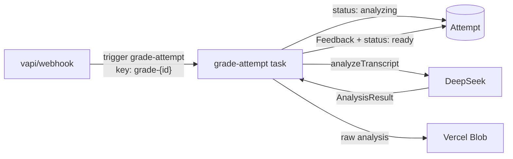

# Grading

Grading turns a finished call's transcript into a structured, evidence-backed
report. It runs **out-of-band** on Trigger.dev so the call-ending path returns
immediately, and it is **idempotent** so the webhook and any reconciliation /
retries collapse into a single grade.

## Flow



## The durable task — `grade-attempt`
Source: [`trigger/grade-attempt.ts`](../trigger/grade-attempt.ts).

- **Payload:** `{ attemptId, transcript: { role, text }[] }`.
- **Idempotency:** keyed `grade-{attemptId}`. If the attempt is already `ready`, the
  task returns early (`alreadyGraded: true`) — the webhook race / retry / local
  reconciliation can all fire without double-grading.
- **Empty transcript:** an immediate hang-up yields no text → the attempt is marked
  `failed` and the run aborts (no retry).
- **Steps:** publishes `received → scoring → saving → done` to run metadata; marks
  the attempt `analyzing`, scores, saves the raw analysis to Blob, then stores the
  structured `Feedback` and flips the attempt to `ready`.
- **Resilience:** `maxDuration` 300s; retry up to 3× with exponential backoff.

Raw transcripts are **not** persisted to our storage — they live in the Trigger run
payload (replayed on retry) and are discarded after grading. The durable records are
the structured `Feedback` row and the raw-analysis blob.

## The analyzer — `analyzeTranscript`
Source: [`lib/analysis.ts`](../lib/analysis.ts).

Builds a strict-JSON prompt for DeepSeek and returns a normalized `AnalysisResult`:

| Field | Meaning |
|---|---|
| `overallScore` | 0–100 (falls back to the mean of dimension scores) |
| `summary` | ≤ 2 sentences |
| `dimensionScores` | one per the interview's `dimensions`, each `{ key, score, note }` |
| `strengths` / `improvements` | exactly 3 each, with a short evidence quote |
| `perQuestion` | one per question: `ratingScore`, `critique`, `modelAnswer` |

Hardening details:
- **Language-aware** — all prose is written in the interview's language.
- **Never trusts the model** — every field is clamped/normalized; missing keys get
  safe defaults, dimension scores are re-keyed to the interview's dimensions, and
  per-question entries are matched by 1-based index.
- **Bounded cost/latency** — transcript truncated to ~24k chars, `temperature 0.2`,
  `maxTokens 3500`.

## The LLM client — `chatJSON`
Source: [`lib/llm.ts`](../lib/llm.ts).

DeepSeek is OpenAI-compatible. `chatJSON`:
- Forces `response_format: { type: "json_object" }`.
- Strips stray ```` ```json ```` fences and, if parsing fails, falls back to the
  first `{…}` span so a prose preamble can't break the turn.
- Retries with exponential backoff + jitter on transport/parse failure.
- Reads `LLM_*` **or** `DEEPSEEK_*` env vars (whichever is set).

The same client backs the conversational builder (`POST /api/builder`).

## Watching it land
The results screen polls `GET /api/attempts/:id` (owner-scoped, never cached) until
`status` is `ready`, then renders the `Feedback`. See
[API reference](api-reference.md#get-apiattemptsid).
