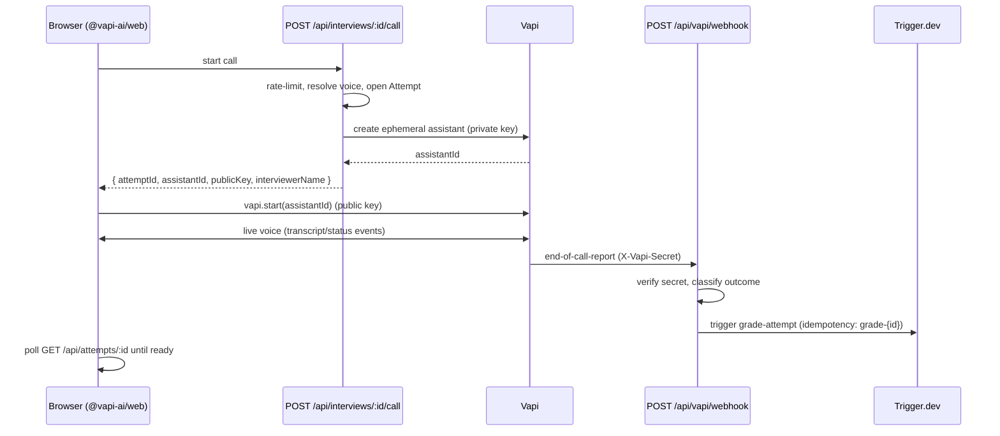

# Voice interview

The voice loop runs on [Vapi](https://vapi.ai). The key design rule: the **system
prompt and interview questions never reach the browser**. The server creates an
ephemeral assistant with the private key and hands the client only an assistant id
and the public key.

## Lifecycle

## Starting a call — `POST /api/interviews/:id/call`
Source: [`app/api/interviews/[id]/call/route.ts`](../app/api/interviews/[id]/call/route.ts).

1. **Auth + rate limit.** Signed-in only; 10 calls/min/user (each call provisions a
   paid assistant). Over the limit → `429` with `Retry-After`.
2. **Env guard.** Requires the Vapi public/private keys, app URL, webhook URL, and
   webhook secret. In production the webhook URL must be public (not localhost) or
   the call is refused (`503`).
3. **Resolve + open.** Looks up the interview (owner-scoped), resolves the
   interviewer persona/voice, and opens an `Attempt` row.
4. **Build the assistant payload.** `buildInterviewJob` → `buildVapiAssistant`
   (`lib/vapi/assistant.ts`) produces the full assistant config: first message,
   system prompt, model + transcriber (Vapi-native, billed by Vapi), the chosen
   voice, turn-taking plans, the webhook URL + auth, and `metadata.attemptId`.
5. **Provision.** Creates the ephemeral assistant via the server SDK
   (`lib/vapi/server.ts`). On any failure the attempt is marked `failed` and the
   assistant is cleaned up.
6. **Return.** Only `{ attemptId, assistantId, publicKey, interviewerName }` reach
   the browser.

## Turn-taking (patience)
`buildVapiAssistant` tunes the conversation for "thinking out loud":
- `firstMessageMode: assistant-speaks-first` — the interviewer opens.
- **Start-speaking plan** — English uses LiveKit *smart* (model-based) endpointing;
  other languages fall back to generous transcription-silence timeouts
  (`onNoPunctuationSeconds ≈ 2.2s`) so the interviewer doesn't cut in on a pause.
- **Stop-speaking plan** — acknowledgement vs interruption phrases so brief "mm-hmm"
  doesn't barge in but "wait/stop" does.
- The model ends the call via an `endCall` **tool** (not a deprecated flag); a hard
  `maxDurationSeconds` cap is the backstop.

## The webhook — `POST /api/vapi/webhook`
Source: route + pure logic in [`lib/vapi/webhook.ts`](../lib/vapi/webhook.ts).

- **Verification.** Checks `X-Vapi-Secret` (and optionally `Authorization: Bearer`)
  against `VAPI_WEBHOOK_SECRET` with a constant-time compare. With a secret set, a
  mismatch is `401`. With **no** secret set, it **fails closed in production**
  (`503`) and is permissive only in dev.
- **Parsing.** `mapReport` pulls the `attemptId` (from assistant/call/message
  metadata), the assistant id, and the transcript (from several possible payload
  shapes), then sanitizes the turns.
- **Outcome classification.** `classifyOutcome`: `abandoned` if there's no candidate
  speech, the end reason is a setup/pipeline failure, or the customer hung up before
  the interviewer's closing turn; otherwise `completed`.
- **Action.** For a completed interview it triggers `grade-attempt` with idempotency
  key `grade-{attemptId}`. It always returns `200` so Vapi does not retry.

## Local development & reconciliation
Vapi cannot reach `localhost`, so end-of-call webhooks won't arrive in local dev.
Two ways to handle it:

- **Tunnel (real webhooks):** set `VAPI_WEBHOOK_URL` to a public ngrok / Vapi CLI
  URL. The assistant's server URL then points at your tunnel.
- **Reconciliation (default):** if the webhook URL is local, the call route logs a
  warning and relies on **server-side reconciliation** (`lib/vapi/reconcile.ts` +
  `mapCallRecord` in `lib/vapi/webhook.ts`), which reads the completed Vapi `/call`
  record and maps it into the same shape as an end-of-call report to repair the
  missed callback.

## Persona voices
Personas (`adi` / `ren` / `kai` / `mira`) are stored as pure records; the spoken TTS
voice is resolved per language in `lib/vapi/voices.ts` (override the catalog with
`VAPI_VOICE_CATALOG`). See [Configuration](configuration.md#vapi-voice).
